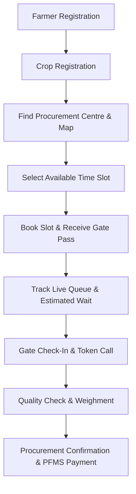
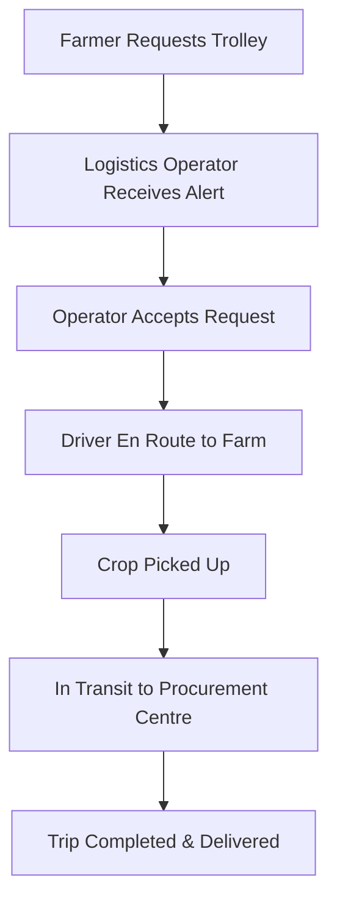
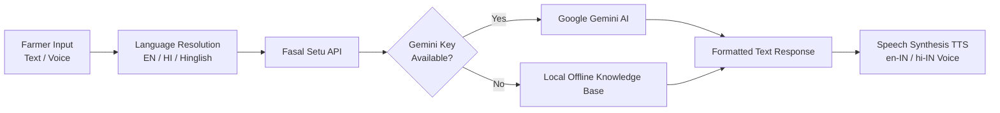
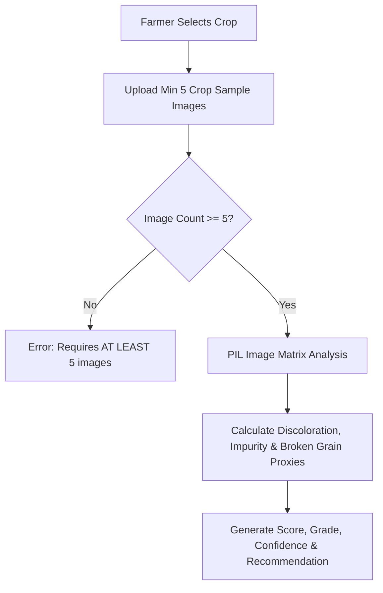
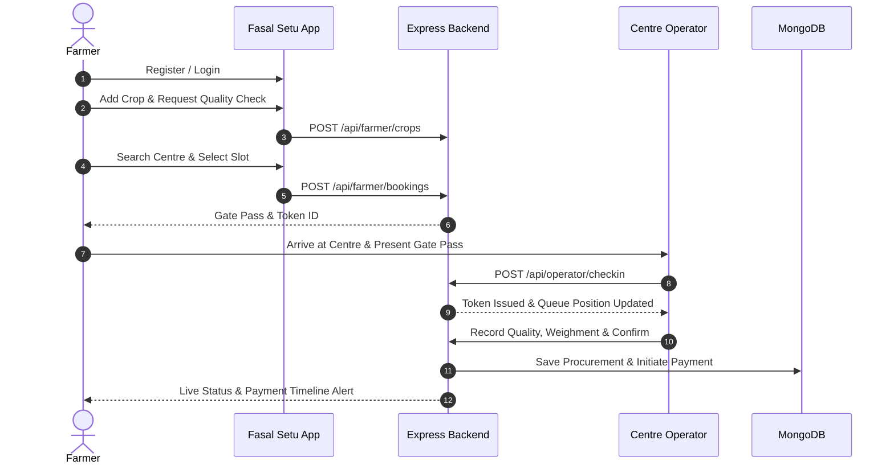
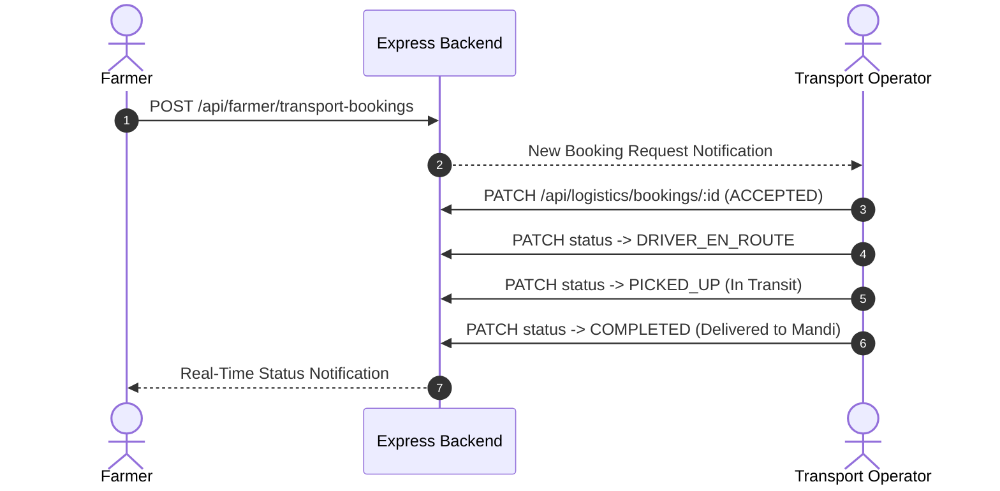

# Fasal Setu

## Smart Farmer Procurement & Queue Management Platform

**Smart India Hackathon 2026**  
**Problem Statement ID: 26032**

Fasal Setu is a farmer-first digital procurement platform designed to streamline and modernize government crop procurement operations. Developed to address critical ground-level challenges faced by Indian farmers during crop harvesting seasons, Fasal Setu connects farmers, procurement centres, centre operators, transport operators, and administrators through a unified real-time system. By digitizing crop registration, slot booking, live queue estimation, quality checks, logistics coordination, and payment tracking, Fasal Setu eliminates chaos at mandi yards and ensures a transparent, dignified procurement experience.

---

## Problem Statement

During agricultural harvest seasons, government procurement centres (mandis) across India experience heavy congestion, unpredictable waiting times, and operational bottlenecks. Farmers often travel long distances with loaded trolleys without prior knowledge of queue lengths, daily center capacity, or operating schedules.

Key challenges addressed by Problem Statement 26032 include:
1. **Long Waiting Times**: Farmers waiting in unmanaged physical queues for hours or days at procurement centres.
2. **Lack of Procurement Schedule Visibility**: No centralized system for farmers to view available time slots or operating hours before leaving their farms.
3. **Uncertainty Regarding Procurement Status**: Lack of real-time visibility into token numbers, live queue movement, estimated wait times, and payment progress.
4. **Logistics & Coordination Difficulties**: Complexities in arranging timely transport (trolleys/tractors) synchronized with procurement slot times.

---

## Our Solution

Fasal Setu introduces a structured, digital-first workflow that transforms chaotic physical procurement into an organized, slot-based process.



### Supporting Logistics Workflow


---

## Key Features

### 🌾 Farmer Modules
- **Self-Registration & Authentication**: Secure registration using mobile/email with demo OTP verification and JWT authentication.
- **Farmer Dashboard**: Unified dashboard providing live status alerts, token cards, active bookings, payment tracking, and quick actions.
- **My Crops Management**: Register cultivated crop details (season, land area, expected production, variety).
- **AI Grain Quality Check**: Upload multi-angle crop sample images for automated prototype visual defect, moisture proxy, and grade analysis (`FAQ`, `Grade A`, `Grade B`, `Below Grade`).
- **Procurement Centre Discovery**: Interactive live map (CARTO Voyager basemaps) and list search filtered by state, district, crop, and status.
- **Slot Booking & Gate Pass**: Book specific arrival time slots with auto-generated gate passes, QR payloads, and slot recommendation algorithms.
- **My Bookings & Cancellation**: View, track, or cancel booked slots prior to arrival.
- **Live Queue & ETA Tracking**: Real-time position updates, token progress, and estimated wait times (minutes).
- **Trolley / Transport Booking**: Request nearby transport operators for farm pickup linked directly to booked procurement slots.
- **Payment Stage Tracking**: Step-by-step payment timeline (`Quality Check` $\rightarrow$ `Weighment` $\rightarrow$ `Bill Confirmation` $\rightarrow$ `PFMS Processing` $\rightarrow$ `Bank Credit`).
- **MSP Calculator**: Calculate total estimated earnings based on crop quantity and government Minimum Support Price (MSP) rates.
- **Grievances & Support**: Raise complaints regarding procurement delay, payment issues, or center facilities with status tracking.
- **KETAN AI Assistant**: Embedded multilingual voice and text assistant for hands-free farmer assistance.

### 🏛️ Admin Modules
- **Executive Analytics Dashboard**: Platform-wide metrics monitoring total farmers, active centres, total procurement volume, payment disbursements, and open grievances.
- **Procurement Centre Management**: Add, update, pause, or view operational centres with geolocation coordinates and daily capacity metrics.
- **Staff & Operator Management**: Register and assign Procurement Operators and Logistics Operators to specific procurement centres.
- **Farmer Directory & Verification**: Inspect registered farmer profiles, land survey records, and bank account verification statuses.
- **System-Wide Booking & Procurement Oversight**: Monitor live bookings, weighment logs, and financial transaction histories.
- **Grievance Resolution**: Review and update farmer grievance statuses with due dates and escalation notes.
- **Reports & Audit Logs**: Access system audit logs and generate administrative operational reports.

### 🏢 Procurement Operator Modules
- **Assigned Centre Dashboard**: Live operational summary of assigned procurement centre, daily capacity utilization, active queue, and staff info.
- **Gate Check-In & Token Issuance**: Verify farmer gate passes, check-in arrivals, and generate sequential queue tokens.
- **Live Queue Management**: Call next farmer in queue (`CALL`), mark completed (`COMPLETE`), or handle no-shows (`CANCEL`).
- **Quality & Weighment Recording**: Record official moisture/grade observations and gross/tare/net weighment scale readings.
- **Bill Confirmation & Payment Initiation**: Confirm final accepted quantity, generate official bills, and initiate demo PFMS payment processing.
- **Centre Status Controls**: Toggle centre operational status (`ACTIVE`, `PAUSED`, `FULL_CAPACITY`, `TEMPORARILY_CLOSED`).

### 🚚 Logistics / Transport Operator Modules
- **Transporter Profile Management**: Register vehicle details (Tractor Trolley / Truck), capacity in quintals, trip fares, and service areas.
- **Transport Request Management**: Receive, inspect, and update farmer transport booking requests.
- **Status Lifecycle Workflow**: 
  $$\text{REQUESTED} \longrightarrow \text{ACCEPTED} \longrightarrow \text{DRIVER\_EN\_ROUTE} \longrightarrow \text{PICKED\_UP} \longrightarrow \text{IN\_TRANSIT} \longrightarrow \text{COMPLETED}$$
- **Linked Booking Info**: Inspect pickup location, crop quantity, destination procurement centre, and farmer contact details.

---

## KETAN — AI Farmer Assistant

KETAN is an AI-assisted farmer procurement assistant embedded across the Fasal Setu platform. Designed specifically for farmers who prefer natural voice or conversational interaction, KETAN provides instant help regarding slot booking, queue status, procurement rules, MSP rates, and transport options.



### Key Capabilities
- **Multilingual Support**: Supports English (`en`), Hindi Devanagari script (`hi`), and Roman Hinglish (`hinglish`).
- **Dynamic Language Resolution**: Automatically respects selected UI dropdown language while preserving natural farmer speech patterns.
- **Voice STT & TTS**: Web Speech API SpeechRecognition (`en-IN`/`hi-IN`) and SpeechSynthesis with voice matching.
- **Gemini AI Integration**: Server-side Google Gemini API integration with custom system instructions preventing key exposure.
- **Offline Fallback Engine**: Local pattern matching knowledge base providing reliable offline answers when network or AI API is unavailable.

---

## AI Grain Quality Check

Fasal Setu features a prototype multi-image computer vision analysis pipeline designed to assist farmers and operators in evaluating crop quality prior to official procurement.



### Analysis & Requirements
- **Multi-Angle Requirement**: The prototype strictly enforces a **minimum of 5 sample images** from different angles to ensure sample representation.
- **Computer Vision Metrics**: Performs RGB matrix analysis calculating discoloration percentage, dark impurity/foreign matter percentage, and edge-sharpness proxies for broken grains.
- **Grading Output**: Computes a composite quality score ($0-100$), confidence rating ($88\% - 98.5\%$), quality grade (`FAQ`, `Grade A`, `Grade B`, `Below Grade`), price deduction percentage, observations, and recommendations.

---

## User Roles

| Role | Responsibilities | Access Control |
|------|------------------|----------------|
| **Farmer** | Self-registers, adds crops, books slots, checks live queue, books transport, tracks payments. | Protected (`role('FARMER')`) |
| **Admin** | Manages centres, registers staff/operators, inspects audit logs, oversees grievances & payments. | Protected (`role('ADMIN')`) |
| **Procurement Operator** | Manages assigned centre, performs farmer check-in, queue management, weighment & payment initiation. | Protected (`role('OPERATOR')`) |
| **Logistics Operator** | Manages transport vehicle profile, accepts trolley booking requests, updates pickup & delivery status. | Protected (`role('LOGISTICS')`) |

---

## End-to-End Workflows

### 1. Farmer Procurement Journey


### 2. Transport Coordination Journey


---

## System Architecture

```text
                                  +---------------------------------------+
                                  |         Farmer / Admin / Operator     |
                                  |           Web Applications            |
                                  |     (Vanilla HTML5 / CSS3 / ES6)      |
                                  +-------------------+-------------------+
                                                      |
                                                      | HTTP / WebSocket
                                                      v
                                  +-------------------+-------------------+
                                  |       Node.js / Express Backend       |
                                  |              (Port 5000)              |
                                  +---------+-----------------+-----------+
                                            |                 |
                   +------------------------+                 +-------------------------+
                   |                                                                    |
                   v                                                                    v
+------------------+------------------+                               +-----------------+-----------------+
|         MongoDB Database            |                               |      Python / FastAPI Service    |
|   (Mongoose Schemas & Models)       |                               |      (Port 8000 AI Microservice)|
+-------------------------------------+                               +-----------------------------------+
                   |                                                                    |
                   v                                                                    v
+------------------+------------------+                               +-----------------+-----------------+
|        Socket.IO Real-time          |                               |        Google Gemini API        |
|  (Rooms: centre:id, farmer:id)      |                               |   (KETAN AI Language Model)     |
+-------------------------------------+                               +-----------------------------------+
```

---

## Technology Stack

| Layer | Technology | Purpose |
|-------|------------|---------|
| **Frontend** | Plain HTML5, Vanilla CSS3, JavaScript (ES6+) | Lightweight, fast-loading, mobile-friendly interface for farmers |
| **Maps** | Leaflet.js, CARTO Voyager Basemaps | Interactive procurement centre map discovery without API key blocks |
| **Backend** | Node.js, Express.js | REST API server, authentication, role-based access control, routing |
| **Database** | MongoDB, Mongoose ODM | Document database for storage of users, centres, slots, bookings, queue |
| **Realtime** | Socket.IO | Real-time queue updates, status changes, and notification broadcasting |
| **Authentication** | JSON Web Tokens (JWT), Bcrypt.js | Stateless authentication and password hashing |
| **AI Assistant** | Google Gemini API (`gemini-2.5-flash`) | Conversational intelligence for KETAN AI Assistant |
| **AI Quality Service**| Python 3, FastAPI, PIL (Pillow), Uvicorn | Prototype multi-image computer vision analysis pipeline |

---

## Current Prototype vs. Future Production

| Feature Area | Current Prototype Implementation | Future Production Target Architecture |
|--------------|----------------------------------|---------------------------------------|
| **Frontend Framework** | Plain HTML5 / CSS3 / Vanilla JS | Next.js / React / TypeScript with Progressive Web App (PWA) offline caching |
| **Database Engine** | Single MongoDB Instance | PostgreSQL with PostGIS extension for spatial queries + Redis caching |
| **AI Quality Analysis**| PIL Image Matrix Analysis Prototype | Deep Learning Vision Model (ResNet/EfficientNet/Vision Transformer) trained on Mandi crop datasets |
| **Identity / KYC** | Demo OTP & Simulated KYC Status | Integration with AgriStack, Aadhaar e-KYC, and PM-KISAN database APIs |
| **Payment Gateway** | Demo PFMS Payment Timeline | Direct integration with National Payment Corporation of India (NPCI) / PFMS APIs |
| **GPS Tracking** | Status-based trip milestone tracking | Live IoT GPS hardware / Driver mobile app location streaming |

---

## Database Design

The database contains 17 specialized Mongoose models:

- **`User`**: Core user authentication details, password hash, role (`FARMER`, `OPERATOR`, `LOGISTICS`, `ADMIN`), assigned centre reference, and transport profile.
- **`OTP`**: One-Time Password hashes, purpose (`REGISTER`/`RESET`), and expiration timestamps.
- **`Farmer`**: Farmer profile details, land survey records (`surveyNo`, `area`), registered crop array, bank details, and verification status flags.
- **`Crop`**: Master catalog of crops, procurement rates, market reference rates, and active season flags.
- **`ProcurementCentre`**: Centre details, geolocation coordinates (`lat`, `lng`), daily slot capacity, and status.
- **`CentreProcurement`**: Active crop procurement schemes per centre, maximum quantities, and operating dates.
- **`Slot`**: Daily time window slots for procurement centres, total capacity, and booked count.
- **`Booking`**: Farmer procurement slot reservations, generated gate pass IDs, and QR payloads.
- **`QueueEntry`**: Live centre queue tokens, queue positions, estimated wait times, check-in, call, and completion timestamps.
- **`Procurement`**: Official procurement transaction records, accepted quantities, quality check results, and gross/tare/net weighment readings.
- **`Payment`**: Financial disbursement tracking, transaction references, payment mode (`DEMO_PFMS`), and stage-by-stage status timeline.
- **`Notification`**: In-app user notifications, channels, priority, read statuses, and metadata.
- **`Grievance`**: Support tickets raised by farmers, categories, due dates, and escalation logs.
- **`Trip`**: Bulk transport movement records linked to operators and destination centres.
- **`TransportBooking`**: Trolley booking requests between farmers and transport operators with full lifecycle status tracking.
- **`Message`**: Contact form inquiries submitted on the public website.
- **`AuditLog`**: System activity logs recording actor ID, action, entity type, and metadata for security compliance.

---

## API Overview

### Authentication (`/api/auth`)
| Method | Endpoint | Purpose |
|--------|----------|---------|
| `POST` | `/api/auth/register` | Farmer self-registration |
| `POST` | `/api/auth/login` | User login (Farmer, Admin, Operator, Logistics) |
| `POST` | `/api/auth/request-otp` | Request OTP for registration / password reset |
| `POST` | `/api/auth/verify-otp` | Verify submission OTP |

### Public & KETAN AI (`/api/public`)
| Method | Endpoint | Purpose |
|--------|----------|---------|
| `GET` | `/api/public/crops` | Public crop catalog & MSP rates |
| `GET` | `/api/public/centres` | All procurement centres & live queue data |
| `GET` | `/api/public/centres/nearby` | Nearby centres lookup by geolocation |
| `GET` | `/api/public/centres/:centreId/slots` | Available slots for a specific centre |
| `GET` | `/api/public/recommended-slots` | Recommended low-wait slot recommendations |
| `GET` | `/api/public/calculate-msp` | Calculate estimated MSP earnings |
| `GET` | `/api/public/live-status/:id` | Live status & token lookup by gate pass ID |
| `POST` | `/api/public/ask` | KETAN AI Assistant conversational endpoint |
| `POST` | `/api/public/quality-check-ai` | Public AI grain quality analysis prototype |

### Farmer API (`/api/farmer`)
| Method | Endpoint | Purpose |
|--------|----------|---------|
| `GET` | `/api/farmer/profile` | Get farmer profile & land/bank verification |
| `GET` | `/api/farmer/status` | Get live queue, token, and payment summary |
| `GET` | `/api/farmer/crops` | List farmer's registered crops |
| `POST` | `/api/farmer/crops` | Register new crop record |
| `POST` | `/api/farmer/crops/:cropId/quality-check` | Run AI Quality Check on crop record |
| `GET` | `/api/farmer/bookings` | List farmer slot bookings |
| `POST` | `/api/farmer/bookings` | Reserve procurement slot & get gate pass |
| `GET` | `/api/farmer/transporters` | Find available transport operators |
| `POST` | `/api/farmer/transport-bookings` | Request trolley pickup from transporter |
| `GET` | `/api/farmer/notifications` | Get in-app notifications |
| `POST` | `/api/farmer/grievances` | Submit grievance ticket |

### Admin API (`/api/admin`)
| Method | Endpoint | Purpose |
|--------|----------|---------|
| `GET` | `/api/admin/summary` | Platform-wide administrative dashboard metrics |
| `GET` | `/api/admin/centres` | List all procurement centres |
| `POST` | `/api/admin/centres` | Add new procurement centre |
| `PATCH`| `/api/admin/centres/:id` | Edit procurement centre details |
| `GET` | `/api/admin/staff` | List all Operators & Transport staff |
| `POST` | `/api/admin/staff` | Register new staff member & assign centre |
| `GET` | `/api/admin/farmers` | List registered farmers directory |
| `GET` | `/api/admin/payments/analytics` | Financial & disbursement analytics |
| `GET` | `/api/admin/audit-logs` | Retrieve system security audit logs |

### Procurement Operator API (`/api/operator`)
| Method | Endpoint | Purpose |
|--------|----------|---------|
| `GET` | `/api/operator/summary` | Assigned centre daily metrics summary |
| `GET` | `/api/operator/queue` | Live centre queue token list |
| `POST` | `/api/operator/checkin` | Check-in farmer gate pass & issue token |
| `PATCH`| `/api/operator/queue/:id` | Call next farmer or complete token |
| `PATCH`| `/api/operator/procurement/:id/quality` | Record official moisture & grade check |
| `PATCH`| `/api/operator/procurement/:id/weighment` | Record gross/tare/net scale weighment |
| `POST` | `/api/operator/procurement/:id/confirm` | Confirm procurement & generate bill |
| `POST` | `/api/operator/payments/:id/process` | Initiate PFMS payment processing |

### Logistics Operator API (`/api/logistics`)
| Method | Endpoint | Purpose |
|--------|----------|---------|
| `GET` | `/api/logistics/summary` | Transporter dashboard metrics summary |
| `GET` | `/api/logistics/bookings` | Get assigned trolley booking requests |
| `PATCH`| `/api/logistics/bookings/:id` | Update trip status (`ACCEPTED`, `IN_TRANSIT`, etc.) |
| `GET` | `/api/logistics/profile` | View & update vehicle capacity/fare profile |

---

## Real-Time Communication

Fasal Setu utilizes Socket.IO for bidirectional, event-driven updates between the backend and user interfaces:

- **`centre:${centreId}` Room**: Procurement Operators and farmers viewing a centre subscribe to this room. When an operator checks in a farmer or updates token status, the server broadcasts `queue:update` events to immediately update wait times and position counters without page reloads.
- **`farmer:${farmerId}` Room**: Individual farmers join their private room upon login. Real-time broadcasts notify farmers when their token is called (`token:called`), when transport status changes (`transport:update`), or when payments transition to PFMS settlement (`payment:update`).

---

## Authentication & Security

- **JSON Web Token (JWT)**: Secure HTTP Authorization headers with standard `Bearer` tokens.
- **Bcrypt Password Hashing**: Passwords are standardly hashed using bcrypt with salt rounds before database storage.
- **Role-Based Access Control (RBAC)**: Middleware enforcing role checks (`FARMER`, `OPERATOR`, `LOGISTICS`, `ADMIN`) on protected routes.
- **Input Sanitization**: Backend query sanitization and parameter trimming against injection vulnerabilities.
- **Environment Variable Protection**: All secrets (`JWT_SECRET`, `GEMINI_API_KEY`, `MONGO_URI`) are strictly loaded via `.env` files and excluded from source control.

---

## Project Structure

```text
fasalSetu3/
├── client/                          # Frontend Vanilla Web Application
│   ├── assets/                      # Static images & farmer slides
│   ├── index.html                   # Public Homepage & Portal Landing
│   ├── farmer-dashboard.html        # Farmer Dashboard Application
│   ├── admin-dashboard.html         # Admin Executive Portal
│   ├── operator-dashboard.html      # Procurement Centre Operator Portal
│   ├── logistics-dashboard.html     # Transport Operator Portal
│   ├── procurement-centres.html     # Public Centre Search & Interactive Map
│   ├── msp-calculator.html          # Public MSP Calculator Tool
│   ├── live-status.html             # Public Live Queue Lookup Tool
│   ├── crops.html                   # Public Crops & Rates Directory
│   ├── app.js                       # Core frontend API & Auth logic
│   ├── dashboard.js                 # Role Dashboard state management
│   ├── ketan.js                     # KETAN AI Assistant UI & Speech engine
│   ├── ketan-knowledge.js           # KETAN Offline Fallback Knowledge Base
│   └── styles.css                   # Unified platform design system
├── server/                          # Backend Node.js Express Application
│   ├── src/
│   │   ├── config/                  # Database & Environment configuration
│   │   ├── controllers/             # API Controller handlers
│   │   ├── middleware/              # Auth & RBAC Middleware
│   │   ├── models/                  # Mongoose Database Models
│   │   ├── routes/                  # Express API Router
│   │   ├── seed/                    # Demo data seeding script
│   │   ├── services/                # Authentication & business logic
│   │   ├── app.js                   # Express app setup & CORS
│   │   └── server.js                # HTTP & Socket.IO Server entry point
│   ├── .env.example                 # Environment configuration template
│   └── package.json                 # Node dependencies manifest
├── python_service/                  # AI Grain Quality Microservice
│   ├── app.py                       # FastAPI Multi-Image CV Pipeline
│   └── requirements.txt             # Python microservice dependencies
├── .gitignore                       # Git exclusion rules
├── .env.example                     # Root environment configuration template
└── README.md                        # Master Project Documentation
```

---

## Local Setup & Installation

### Prerequisites
- **Node.js**: v18.0.0 or higher
- **MongoDB**: Community Server running locally on port `27017` or MongoDB Atlas URI
- **Python**: v3.9+ (Optional, for Python AI Grain Quality microservice)

### Step 1: Clone Repository
```bash
git clone https://github.com/your-team/fasalSetu.git
cd fasalSetu
```

### Step 2: Configure Environment Variables
Copy `.env.example` to `server/.env`:
```bash
cp server/.env.example server/.env
```
Edit `server/.env` to configure your MongoDB connection string and Google Gemini API key:
```env
PORT=5000
MONGO_URI=mongodb://127.0.0.1:27017/fasalSetu
JWT_SECRET=your_random_jwt_secret_key
CLIENT_URL=http://127.0.0.1:5000
OTP_MODE=DEMO
GEMINI_API_KEY=your_gemini_api_key_from_google_ai_studio
GEMINI_MODEL=gemini-2.5-flash
```

### Step 3: Install Node Dependencies & Seed Database
```bash
cd server
npm install
node src/seed/seed.js
```

### Step 4: Start Node Backend Server
```bash
npm start
# Server will run on http://localhost:5000
```

### Step 5: (Optional) Run Python AI Quality Microservice
```bash
cd ../python_service
pip install -r requirements.txt
python app.py
# AI microservice will run on http://localhost:8000
```

### Step 6: Access Web Application
Open your browser and navigate to:
```text
http://localhost:5000/index.html
```

#### Demo Credentials for Testing
- **Farmer**: `9876543210` / `Farmer@123`
- **Procurement Operator**: `operator@fasalsetu.demo` / `Operator@123`
- **Transport Operator**: `logistics@fasalsetu.demo` / `Logistics@123`
- **Admin**: `admin@fasalsetu.demo` / `Admin@123`

---

## License & Team

Developed for **Smart India Hackathon 2026** under **Problem Statement ID 26032**.  
*Fasal Setu is a student hackathon prototype and not an official government platform.*
